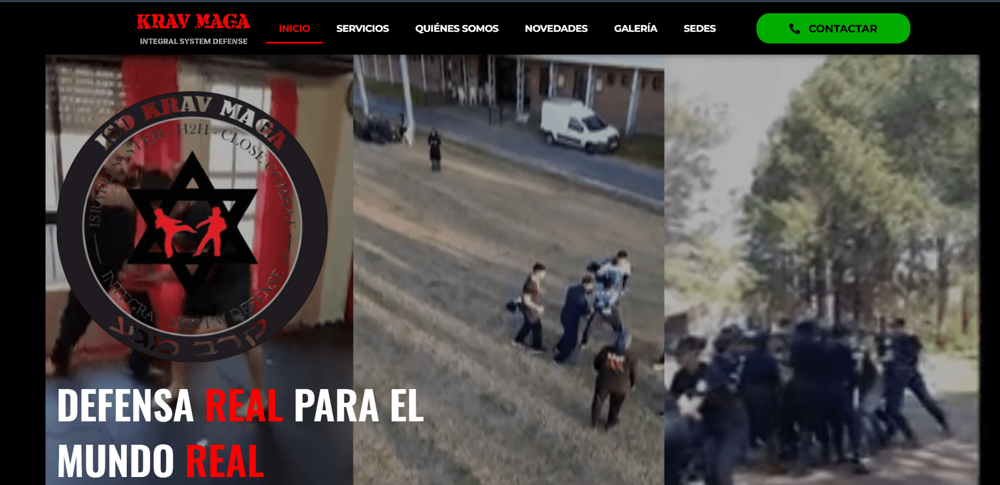
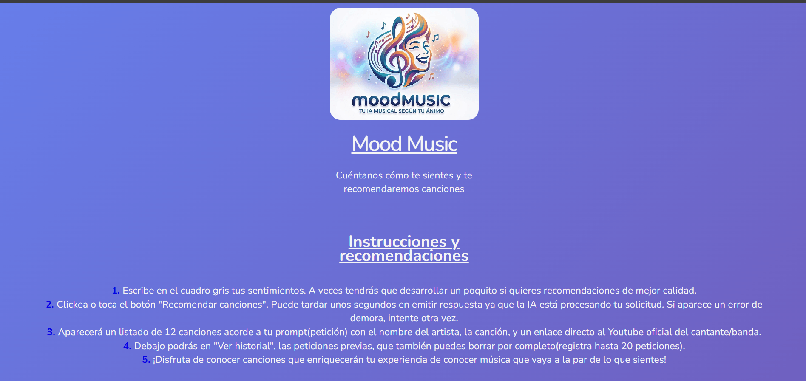
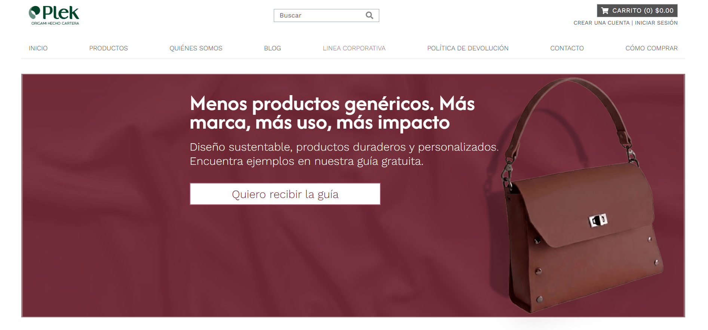
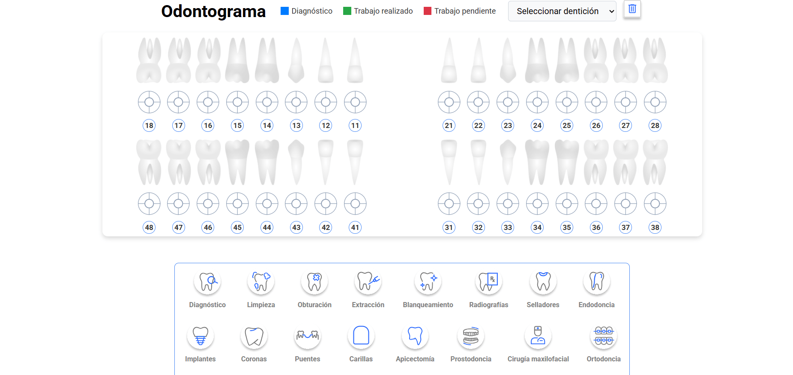
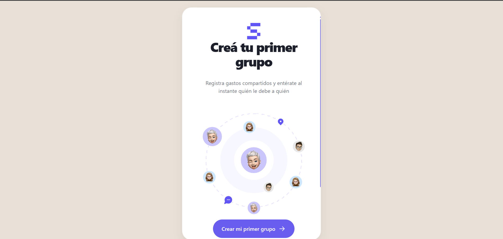

<pre style="background:#0d1117; color:#e6edf3; padding:20px 24px; border-radius:16px; border:1px solid #30363d; display:block; font-family:'Fira Code', monospace; font-size:18px; line-height:1.6; box-shadow: 0 8px 32px rgba(0,0,0,0.45); margin-left:0;">
<code style="font-family:inherit; font-size:18px;">{
  "completeName": "Carolina Alejandra Pena Astigarraga",
  "roles": ["Frontend Developer", "QA Tester"],
  "location": "Pilar, Buenos Aires, Argentina",
  "birthDate": "10/10/2001",
  "description": "Desarrolladora Frontend y QA Tester con experiencia práctica combinando la creación de interfaces web modernas (React.js, Astro) y el aseguramiento de la calidad del software (pruebas funcionales, regresión y API testing con Postman). Experiencia en proyectos bajo metodologías Ágiles(Scrum), integración de herramientas de IA y habilidades demostradas de liderazgo y gestión.",
  "age": "25",
  "experience": "2+ años",
  "philosophy": "Desarrollo y calidad van de la mano como lo hacen el panqueque y el dulce de leche",
  "mainTechs": ["React", "JavaScript", "Astro"],
  "QATechs": ["QA Manual", "API Testing (Postman)", "Pruebas Funcionales", "Regresión", "Smoke", "Mobile & Game Testing", "Diseño de Casos de Prueba", "Reporte de Bugs", "Lighthouse"]
}</code>
</pre>

 ## 🏆 Experiencia profesional
##### No Country | Desarrolladora Frontend (Prácticas) | 08/2026 – 10/2026
- Desarrollo del proyecto SplitFlow, que resuelve el problema de gestión de gastos y deudas en grupos en
situaciones de viajes, salidas y más.
- Colaboración en equipo multidisciplinario bajo metodología Agile/Scrum mediante Notion y control de versiones
con Git/GitHub.
##### No Country | Desarrollador Frontend (prácticas) | 03/2026 – 04/2026
- Desarrollo de la landing page B2B para el proyecto Plek utilizando Astro, JavaScript y CSS modular, logrando
una carga ultrarrápida y diseño 100% responsive.
- Creación de componentes UI reutilizables e integración de formularios de captación de leads, incrementando
la presencia digital del producto.
- Colaboración en
##### MakiSan Tech | Desarrollador Frontend (pasantía) | 04/2025 – 02/2026
- Desarrollo de la aplicación web de gestión clínica OdontoGes con React.js, JavaScript y CSS.
- Implementación del módulo de gestión de pacientes, agenda de turnos y visualización interactiva del
odontograma digital del sistema OdontoGes.
- Integración de persistencia de datos y optimización de la experiencia de usuario (UI/UX).
##### FooTalent Group | QA Tester (prácticas) | 11/2024 – 02/2025
- Aseguramiento de calidad en la plataforma Respawn Events, diseñando y ejecutando casos de prueba
funcionales en ClickUp.
- Ejecución de pruebas de humo (Smoke Testing) y regresión.
- Reporte y seguimiento de defectos en el ciclo de vida del bug, colaborando con los desarrolladores para
asegurar entregas estables previa producción.
##### Abogados Martinelli y Asociados | Secretaria Administrativa | 02/2023 – Actualidad
- Gestión documental, digitalización de expedientes complejos y control de calidad administrativo con alto nivel
de precisión.
- Atención a clientes: Comunicación directa con clientes, juzgados y colaboradores, aplicando escucha activa y
resolución rápida de incidencias.
##### Asociación Italiana de Socorros Mutuos Pilar | Instructor de artes marciales y defensa personal | 03/2021 – Actualidad
- Liderazgo de grupos y gestión de imprevistos bajo presión.
- Desarrollo e implementación del sitio web oficial de la academia.

### 💻 Mi Stack como Dev/QA

                                        

### Además...

Game testing 🕹️
Pruebas funcionales/no funcionales
UX/UI
Metodologías ágiles
Diseño, creación y ejecución de casos de prueba
Desarrollo/maquetado web
Trabajo en equipo
Mobile Testing
Diseño responsive, y mucho más...

 ### 🏆 Experiencia profesional
##### No Country | Desarrolladora Frontend (Prácticas) | 08/2026 – 10/2026
- Desarrollo del proyecto SplitFlow, que resuelve el problema de gestión de gastos y deudas en grupos en
situaciones de viajes, salidas y más.
- Colaboración en equipo multidisciplinario bajo metodología Agile/Scrum mediante Notion y control de versiones
con Git/GitHub.
##### No Country | Desarrollador Frontend (prácticas) | 03/2026 – 04/2026
- Desarrollo de la landing page B2B para el proyecto Plek utilizando Astro, JavaScript y CSS modular, logrando
una carga ultrarrápida y diseño 100% responsive.
- Creación de componentes UI reutilizables e integración de formularios de captación de leads, incrementando
la presencia digital del producto.
- Colaboración en
##### MakiSan Tech | Desarrollador Frontend (pasantía) | 04/2025 – 02/2026
- Desarrollo de la aplicación web de gestión clínica OdontoGes con React.js, JavaScript y CSS.
- Implementación del módulo de gestión de pacientes, agenda de turnos y visualización interactiva del
odontograma digital del sistema OdontoGes.
- Integración de persistencia de datos y optimización de la experiencia de usuario (UI/UX).
##### FooTalent Group | QA Tester (prácticas) | 11/2024 – 02/2025
- Aseguramiento de calidad en la plataforma Respawn Events, diseñando y ejecutando casos de prueba
funcionales en ClickUp.
- Ejecución de pruebas de humo (Smoke Testing) y regresión.
- Reporte y seguimiento de defectos en el ciclo de vida del bug, colaborando con los desarrolladores para
asegurar entregas estables previa producción.
##### Abogados Martinelli y Asociados | Secretaria Administrativa | 02/2023 – Actualidad
- Gestión documental, digitalización de expedientes complejos y control de calidad administrativo con alto nivel
de precisión.
- Atención a clientes: Comunicación directa con clientes, juzgados y colaboradores, aplicando escucha activa y
resolución rápida de incidencias.
##### Asociación Italiana de Socorros Mutuos Pilar | Instructor de artes marciales y defensa personal | 03/2021 – Actualidad
- Liderazgo de grupos y gestión de imprevistos bajo presión.
- Desarrollo e implementación del sitio web oficial de la academia.

#### 🤓 Idiomas
Inglés (Intermedio) | Japonés (Básico)

#### 🤓 Otras curiosidades

Cuento con un repositorio donde tengo todos los certificados que avalan mis diversas habilidades: https://github.com/caropenaIt/Mis-Certificados

Ver mas en mi CV(Curriculum Vitae) adjunto en este repositorio: https://github.com/caropenaIt/caropenaIt

Cuento con mi sitio web de portfolio donde podrás ver mis trabajos tanto como Desarrolladora Frontend como de QA. te dejo el link del sitio + el repositorio del código:
- Web: https://carolina-pena-portfolio-devqa.netlify.app/
- Repositorio: https://github.com/caropenaIt/miportfolio

## 🏆 Proyectos destacados 🏆

<table width="100%" cellpadding="8" cellspacing="8" border="0" frame="void" rules="none" align="center">
  <tr>
    <td align="center" valign="top" width="25%" border="0">
       
      <strong>Krav Maga ISD</strong> Sitio web oficial de Krav Maga ISD
    </td>
    <td align="center" valign="top" width="25%" border="0">
       
      <strong>Mood Music</strong> Música según tu estado de ánimo
    </td>
    <td align="center" valign="top" width="25%" border="0">
       
      <strong>Plek - Origami hecho cartera</strong> Landing page creada en No Country
    </td>
    <td align="center" valign="top" width="25%" border="0">
       
      <strong>Odontograma</strong> Odontograma funcional desarrollado en mi paso por MakiSan Tech
    </td>
    <td align="center" valign="top" width="25%" border="0">
       
      <strong>SplitFlow - Experiencia Digital para Gestionar Gastos Compartidos</strong> Web-app creado en No Country. 
    </td>
  </tr>
</table>

#### 🌐 Contacto

   

### 📊 Estadísticas/Stats

#### ✍️ Frases aleatorias de devs y más

